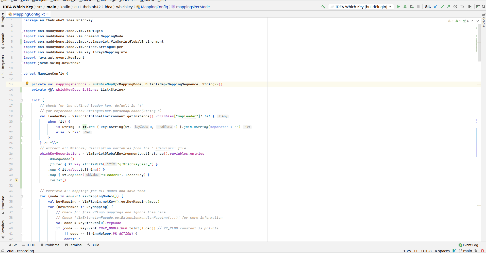

[](https://plugins.jetbrains.com/plugin/15976-idea-which-key)

# Which-Key

[IdeaVim](https://github.com/JetBrains/ideavim) extension that displays available keybindings in a popup similar to [vim-which-key](https://github.com/liuchengxu/vim-which-key)



> Which-Key only displays **available** keybindings, it will not set them for you ([#44](https://github.com/TheBlob42/idea-which-key/issues/44), [#46](https://github.com/TheBlob42/idea-which-key/issues/46))  
> For a "complete" setup you might have a look at [intellimacs](https://github.com/MarcoIeni/intellimacs) (which was used for the GIF above)

## Installation

### JetBrains Marketplace

Install the plugin from the official [JetBrains Marketplace](https://plugins.jetbrains.com/plugin/15976-idea-which-key)

Within Intellij go to *File -> Settings -> Plugins -> Marketplace* search for "Which Key" and click on *Install*

### Manual Installation

To build and install the plugin directly from source run the Gradle task `buildPlugin`

Afterwards you find the built jar under `/build/libs`

Install the jar in Intellij via *File -> Settings -> Plugins -> Install Plugin from Disk...*


### Activation

Since this is an extension plugin for IdeaVim you have to activate it explicitly within your `.ideavimrc` file  
Furthermore you should either disable the `timeout` option or increase the value for `timeoutlen`

```vim
set which-key

" disable the timeout option
set notimeout

" increase the timeoutlen (default: 1000), don't add space around the equal sign
set timeoutlen=5000
```

#### Explanation: `timeout` & `timeoutlen`

By default (Idea)VIM will wait for `timeoutlen` milliseconds after each key press of any unfinished mapping sequence before it cancels the whole sequence and processes each key press individually one after another. To match this behavior the IDEA-Which-Key popup will only be visible till a mapping sequence is either completed or canceled. Without any adaptions the popup is only displayed for a brief moment and will not be very useful. Therefore you should definitively modify `timout` or `timeoutlen` according to your preferences.

> IdeaVIM does not differentiate between `timeout`|`timeoutlen` and `ttimeout`|`ttimeoutlen`

## Customization

You can customize several aspects of Which-Key via variables in your `.ideavimrc`

> Use the `:action IdeaVim.ReloadVimRc.reload` command to reload your config file

### Descriptions

If no custom descriptions are defined, the right-hand side of all mappings will be displayed:


To provide custom names for prefixes and commands we need to configure one variable for every mapping:

```vim
let g:WhichKeyDesc_windows        = "<Space>w  Windows"
let g:WhichKeyDesc_windows_delete = "<Space>wd delete"
let g:WhichKeyDesc_windows_split  = "<Space>ws split below"
...
```

The `<leader>` key is also supported:

```vim
let g:WhichKeyDesc_windows_maximize = "<leader>wm maximize"
```


You can also remove prefixes and mappings from being displayed at all by providing a blank custom description:  
(this will **not** unmap them, it will just remove their appearance from the popup)

```vim
let g:WhichKeyDesc_commentray_prefix = "gc"
let g:WhichKeyDesc_commentray_action = "gcc"
```

Every variable's name has to start with `g:WhichKeyDesc_` in order to be recognized by the plugin. The rest of the variable name can be set to whatever fits best with you. For the value of each variable use the left-hand side of the mapping followed by at least one space or tab characters and finished with the description string you want to be displayed.

Or if you prefer it in regular expressions:

| Part  | Regex                          | Details                                                       |
|-------|--------------------------------|---------------------------------------------------------------|
| Name  | `g:WhichKeyDesc_[a-zA-Z0-9_]+` | the only valid characters for variable names are `a-zA-Z0-9_` |
| Value | `([^ \t]+)[ \t]*(.*)`          | group one is the mapping, group two your description          |

If you are familiar with [vim-which-key](https://github.com/liuchengxu/vim-which-key) or the emacs package [which-key](https://github.com/justbur/emacs-which-key) this handling seems odd and very inconvenient, as it requires a lot of variable definitions and therefore a lot of repetition. Unfortunately this is the case because the IdeaVim plugin only supports the following four types of variables:

- single quoted string
- double quoted string
- decimal number
- reference to another variable

Due to this limitation and the lack of any more convenient data types (array, list, dictionary, etc.) there is currently no "nicer" way of handling custom descriptions.

> As of writing the current versions are Intellij 2020.3 and IdeaVim 0.64

### VIM Actions

By default Which-Key will only display key mappings which are defined in the `.ideavimrc` file. If you wish it can also display default VIM actions like `gg`, `zz`, `zt`, `<C-w>k`, etc. in the popup. For this you need to set the following variable within your `.ideavimrc`:

```vim
let g:WhichKey_ShowVimActions = "true"
```

If you wish you can also add custom descriptions for VIM Actions the same way as for other key mappings:

```vim
let g:WhichKeyDesc_goto_top = "gg goto first line"
```

### Typed Keys

At the bottom of the popup you can see the keys you have typed so far as well as the current prefix description

You can hide this by adding the following to your `.ideavimrc`:

```vim
let g:WhichKey_ShowTypedSequence = "false"
```

### Delay

In order to prevent the popup from "flickering" on fast consecutive key presses, there is a default delay of 200ms before it appears

You can configure this value so the popup appears faster or slower after a key press. The unit for the delay is milliseconds (ms):

```vim
" make the popup show up 'instantly'
let g:WhichKey_DefaultDelay = 0

" make the popup appear much slower
let g:WhichKey_DefaultDelay = 600
```

### On Unknown Mapping

With the popup open pressing any key that is not mapped to any further prefix or action will close it and process all typed keys individually with their default actions

If you prefer to just close the popup without any further processing you can configure this:

```vim
" close the popup and don't process formerly typed keys
let g:WhichKey_ProcessUnknownMappings = "false"
```

<details>
<summary><b>Caveats</b></summary>

##### Insert Mode

This will never block insert mode mappings in order to enable mappings like `imap jk <Esc>` without interfering with characters you actually want to type. It also should¹ not interfere with operator commands or motions which are not "real" mappings like `hjkl`, `d`, `f`, etc.

¹*If you encounter any weird behavior please open an issue, as there might be edge cases not covered yet*

##### Ending On A Special Key

If you end your "unknown key sequence" on a special key (`<Esc>`, `<Tab>`, any combination with `Control`, `Alt` etc.) this option will not work as expected and your previous keys will still be executed. The reason is that Which-Key can't intercept those key presses and does not realize that it should not process any previous keys. See also the [Known Issues](#known-issues) section for more information on the matter
</details>

### Order

By default all elements of the popup are ordered alphabetically by the key you have to press.

You can change this by setting the value for the variable `g:WhichKey_SortOrder` to one of the following options:

| Value                 | Description                                                                    |
|-----------------------|--------------------------------------------------------------------------------|
| `by_key`              | Sort all elements alphabetically by their key (default)                        |
| `by_key_prefix_first` | Same as `by_key` but all prefix entries are ordered before any command mapping |
| `by_key_prefix_last`  | Same as `by_key` but all prefix entries are ordered after any command mapping  |
| `by_description`      | Sort all elements alphabetically by their description                          |

Note that by default all order is based on case-sensitive sorting (so `Z` comes before `a`).

You can change this default by setting the `g:WhichKey_SortCaseSensitive` variable to `false` (default: `true`).

```vim
" set how the elements should be ordered
let g:WhichKey_SortOrder = "by_key_prefix_first"

" set if the sorting should be case-sensitive or not
let g:WhichKey_SortCaseSensitive = "false"
```

### Appearance

You can configure the appearance of certain UI elements by setting the following options:

| Variable                  | Description                            | Values                                                                                       | Default Value |
|---------------------------|----------------------------------------|----------------------------------------------------------------------------------------------|---------------|
| `g:WhichKey_Divider`      | String to separate key and description | any string                                                                                   | ` → `         |
| `g:WhichKey_FontFamily`   | Font to use for the popup              | CSS `font-family` (see [examples](https://www.w3schools.com/cssref/pr_font_font-family.asp)) | `monospace`   |
| `g:WhichKey_FontSize`     | Font size for the popup                | Font size in `point` (for example `15`, `22`, etc.)                                          | IDE default³  |
| `g:WhichKey_KeyStyle`     | Font style for the keys                | `bold`, `italic`, `none`                                                                     | `bold`        |
| `g:WhichKey_KeyColor`     | Font color for the keys                | hex code or color keyword<br/>(`default`¹, `keyword`², "red", "blue", etc.)                  | `default`     |
| `g:WhichKey_PrefixStyle`  | Font style for the prefixes            | `bold`, `italic`, `none`                                                                     | `none`        |
| `g:WhichKey_PrefixColor`  | Font color for the prefixes            | hex code or color keyword<br/>(`default`¹, `keyword`², "red", "blue", etc.)                  | `keyword`     |
| `g:WhichKey_CommandStyle` | Font style for the commands            | `bold`, `italic`, `none`                                                                     | `none`        |
| `g:WhichKey_CommandColor` | Font color for the commands            | hex code or color keyword<br/>(`default`¹, `keyword`², "red", "blue", etc.)                  | `default`     |

¹`default`: the default foreground color of the currently used theme  
²`keyword`: the color for "keywords" of the currently used theme  
³Uses the IDE default value for the font size (without any configuration this should be `15`)

## Known Issues

The way the plugin injects itself into the flow of IdeaVIM to provide its features is a little "hacky" and you might encounter some inconsistencies. If you encounter anything not documented open an issue so we can check and maybe fix it. These are the ones that I am aware of

### Special Prefixes

Consider the following mapping sequence example which contains a modified key press (`<C-a>`) within:

> What the mapping does is not important for the example

```text
noremap g<C-a>bc ...
```

If you are about to activate this mapping the following will happen:

| Press   | What will happen                                   |
| ---     | ---                                                |
| `g`     | The popup will appear and show `<C-a>` as a prefix |
| `<C-a>` | The popup will close itself                        |
| `b`     | The popup will reopen and show `c` as a command    |
| `c`     | This will close the popup and execute your mapping |


The reason for this is that we currently have no way to intercept modified & special key presses like `<C-a>`, `<Esc>`, `<A-a>` etc. Vim internal actions like `<C-d>` or `<C-o>` are handled as a custom action instead of being processed by a general handler like "regular" key presses

If you have more knowledge about the internals of IdeaVIM in this regard or have another idea how to solve this issue, please open an issue or PR
